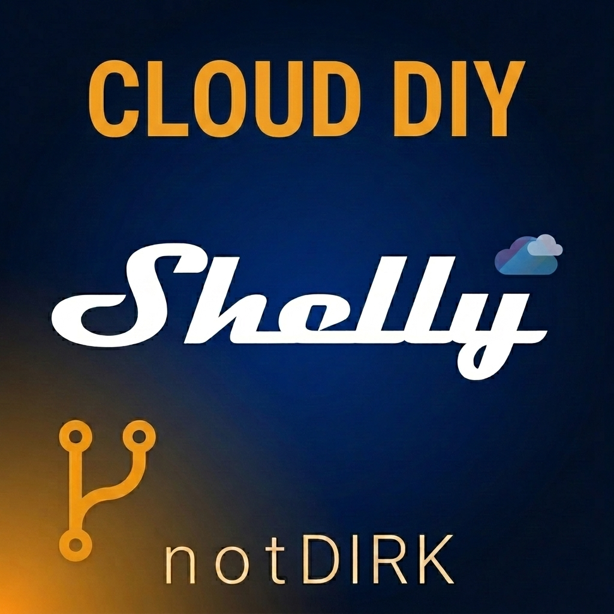

# Shelly Cloud DIY — Home Assistant integration

> 🚧 **Status: active pivot in progress.** There is **no stable release yet** for this new direction. The `v0.2.x` tags in this repo are the legacy **Integrator API** implementation (inherited from the engesin upstream); `v0.3.0+` will be the first release built on the **Cloud Control API**. See [`docs/ROADMAP.md`](docs/ROADMAP.md) for milestones.
>
> 🚧 **Status: Aktuell in der Pivot-Phase.** Es gibt **noch kein Stable-Release** für die neue Richtung. Die `v0.2.x`-Tags in diesem Repo sind die Legacy-**Integrator-API-Implementierung** (geerbt vom engesin-Upstream); `v0.3.0+` wird das erste Release auf Basis der **Cloud Control API**. Meilensteine in [`docs/ROADMAP.md`](docs/ROADMAP.md).

---

## What this is · Was das ist

**English** — A Home Assistant custom integration that connects your HA instance to the Shelly Cloud using the **self-service Cloud Control API path**. You paste an `auth_key` from the Shelly App and your devices — including devices shared with you by other Shelly users — show up as entities in HA. Supports Shelly Gen1, Gen2/Gen3, and BLE-bridged devices (Shelly BLU family, gateway-reported third-party BLE sensors).

**Deutsch** — Eine Home-Assistant-Custom-Integration, die deine HA-Instanz über den **Self-Service-Pfad der Cloud Control API** an die Shelly Cloud anbindet. Du kopierst einen `auth_key` aus der Shelly-App, und deine Geräte — inklusive solcher, die andere Shelly-User mit dir geteilt haben — erscheinen als Entities in HA. Unterstützt Shelly Gen1, Gen2/Gen3 und BLE-überbrückte Geräte (Shelly-BLU-Familie, Gateway-gemeldete BLE-Fremdsensoren).

---

## Why this exists · Warum das Projekt existiert

**English** — Shelly publishes two cloud APIs: an **Integrator API** meant for commercial integrators (explicitly *"Licenses for personal use are not provided."* per [Shelly's own docs](https://shelly-api-docs.shelly.cloud/integrator-api/)) and a **Cloud Control API** available to any Shelly user with an account. The popular existing community integration [`engesin/shelly-integrator-ha`](https://github.com/engesin/shelly-integrator-ha) uses the Integrator API, so private users tend to get stuck at the "contact Shelly support" step (see [upstream issue #1](https://github.com/engesin/shelly-integrator-ha/issues/1)). The Cloud Control API has a self-service key available directly in the Shelly App — but no maintained HA integration takes the full advantage of it. This project fills that gap.

**Deutsch** — Shelly veröffentlicht zwei Cloud-APIs: eine **Integrator API** für kommerzielle Integratoren (explizit *"Licenses for personal use are not provided."* laut [Shelly-Docs](https://shelly-api-docs.shelly.cloud/integrator-api/)) und eine **Cloud Control API**, die für jeden Shelly-Account verfügbar ist. Die verbreitete Community-Integration [`engesin/shelly-integrator-ha`](https://github.com/engesin/shelly-integrator-ha) nutzt die Integrator API, weswegen Privatanwender meistens am „Shelly-Support anschreiben"-Schritt scheitern (siehe [Upstream-Issue #1](https://github.com/engesin/shelly-integrator-ha/issues/1)). Die Cloud Control API hat einen Self-Service-Key direkt in der Shelly-App — aber keine gepflegte HA-Integration nutzt das voll. Dieses Projekt schließt diese Lücke.

---

## Differentiation · Abgrenzung

| Project | Auth | Realtime | Shared devices | Maintained |
|---|---|---|---|---|
| **`shelly-cloud-diy-ha`** *(this repo)* | `auth_key` (M1) / OAuth (M2) | HTTP poll 5 s (M1) → WebSocket push (M2) | ✅ | 🔄 active |
| [`engesin/shelly-integrator-ha`](https://github.com/engesin/shelly-integrator-ha) | Integrator API token *(gated — no private-use licences)* | WebSocket push | ❌ | ✅ |
| [HA Core — official Shelly integration](https://www.home-assistant.io/integrations/shelly/) | Local LAN / mDNS | LAN push | ❌ *(remote / shared devices unreachable over LAN)* | ✅ |
| [`StyraHem/ShellyForHASS`](https://github.com/StyraHem/ShellyForHASS) | Local LAN | LAN push | ❌ | ❌ **discontinued** per upstream README |
| [`vincenzosuraci/hassio_shelly_cloud`](https://github.com/vincenzosuraci/hassio_shelly_cloud) | Username/password *(reverse-engineered)* | HTTP polling | ? | ❌ last push 2019 |
| [HA YAML Blueprint (2025)](https://community.home-assistant.io/t/controlling-shelly-cloud-devices-in-home-assistant/928462) | `auth_key` | ❌ command-only, no state read | ? | ✅ |
| [`corenting/poc_shelly_cloud_control_api_ws`](https://github.com/corenting/poc_shelly_cloud_control_api_ws) | OAuth | WebSocket | ? | POC, not an integration |

**English** — Today there is **no maintained HA integration that combines Cloud-Control-API-based state reading, shared-device support, and BLE/gateway coverage in one package**. That gap is what `shelly-cloud-diy-ha` exists to fill.

**Deutsch** — Aktuell gibt es **keine gepflegte HA-Integration, die Cloud-Control-API-basiertes State-Lesen, Shared-Device-Support und BLE-/Gateway-Abdeckung in einem Paket vereint**. Genau diese Lücke füllt `shelly-cloud-diy-ha`.

---

## Requirements · Voraussetzungen

**English**:
- A Shelly Cloud account and at least one device paired to it
- Home Assistant 2024.1 or newer
- Reachable-from-HA outbound HTTPS to the Shelly Cloud (standard)
- **No** need for Home Assistant to be externally reachable from the internet (the Cloud Control API is request/response from HA outbound — no inbound webhook required for M1)

**Deutsch**:
- Ein Shelly-Cloud-Account mit mindestens einem verknüpften Gerät
- Home Assistant 2024.1 oder neuer
- Ausgehendes HTTPS von HA zur Shelly-Cloud erreichbar (Standard)
- **Kein** externer Internet-Zugang auf die HA-Instanz nötig (die Cloud Control API ist Request/Response von HA raus — kein Inbound-Webhook erforderlich in M1)

---

## Getting your credentials · Credentials besorgen

**English** — This is truly self-service, unlike the Integrator API:

1. Open the **Shelly App**.
2. Go to **User settings** → **Authorization cloud key**.
3. Tap **GET KEY**.
4. You get two values: an **`auth_key`** (long opaque string) and a **server URI** (something like `shelly-42-eu.shelly.cloud`).
5. Both values are what you paste into the HA config flow. That's it — no email to Shelly, no waiting, no approval process.

**Deutsch** — Das ist tatsächlich Self-Service, anders als bei der Integrator API:

1. **Shelly-App** öffnen.
2. Zu **Benutzereinstellungen** → **Authorization cloud key** gehen.
3. Auf **GET KEY** tippen.
4. Du bekommst zwei Werte: einen **`auth_key`** (langer undurchsichtiger String) und eine **Server-URI** (etwa `shelly-42-eu.shelly.cloud`).
5. Beides kopierst du im HA-Konfigurations-Dialog ein. Fertig — keine E-Mail an Shelly, kein Warten, kein Freigabeprozess.

> 🔐 **Security note · Sicherheitshinweis** — The `auth_key` grants control of every device your Shelly account can see (including shared ones). Treat it like a password. Rotation: change your Shelly password in the App → the key invalidates server-side and a new one appears.
>
> Der `auth_key` gibt Kontrolle über jedes Gerät, das dein Shelly-Account sieht (inklusive geteilter). Behandle ihn wie ein Passwort. Rotation: Shelly-Passwort in der App ändern → Key wird serverseitig invalidiert und ein neuer taucht auf.

---

## Rate limits and latency · Rate-Limits und Latenz

Shelly documents a rate limit of **1 API request per second per account** ([source](https://shelly-api-docs.shelly.cloud/cloud-control-api/)).

| | Milestone 1 (current scope) | Milestone 2 (future) |
|---|---|---|
| Mechanism | HTTP polling | WebSocket push |
| State-update latency (p50 / p99) | ~2.5 s / ~5 s | < 100 ms / < 500 ms |
| Outbound traffic (50-device account) | ≈ 12 KB/s avg at 5 s poll | 0 bytes steady |
| Commands (switch on/off, dim, …) | immediate HTTP POST | via WebSocket |
| Credential required | `auth_key` only | Shelly email + password (OAuth) |

**English** — The 5-second poll default is chosen to stay well under Shelly's 1-req/s budget while leaving command headroom. Sensor and weather-station values feel live enough; switch feedback feels "gentle". Milestone 2 will close that gap.

**Deutsch** — Das 5-Sekunden-Poll-Default ist so gewählt, dass wir deutlich unter Shellys 1-req/s-Budget bleiben und Command-Reserve behalten. Sensor- und Wetterstations-Werte fühlen sich „live genug" an; Schalt-Feedback fühlt sich „gemütlich" an. Meilenstein 2 schließt genau diese Lücke.

---

## Installation (via HACS custom repository) · Installation (via HACS-Custom-Repository)

> Currently available as a custom repository only. HACS-default-store submission is planned (Milestone 3).
>
> Aktuell nur als Custom Repository verfügbar. HACS-Default-Store-Aufnahme ist geplant (Meilenstein 3).

1. Open **HACS** in Home Assistant.
2. Click the three-dots menu → **Custom repositories**.
3. Paste the repository URL: `https://github.com/notDIRK/shelly-cloud-diy-ha`
4. Select category **Integration** and click **Add**.
5. Find **Shelly Cloud DIY** in the HACS integration list, click **Download**.
6. Restart Home Assistant.
7. Continue with *Setup* below.

---

## Setup

1. Home Assistant → **Settings → Devices & Services → Add Integration → "Shelly Cloud DIY"**
2. Paste your `auth_key`.
3. Paste your `server URI` (e.g. `shelly-42-eu.shelly.cloud`).
4. Click **Submit**. Devices are fetched immediately.

*Same steps, German labels:* **Einstellungen → Geräte & Dienste → Integration hinzufügen → "Shelly Cloud DIY"**, `auth_key` + Server-URI einfügen, **Absenden**.

---

## Roadmap

See [`docs/ROADMAP.md`](docs/ROADMAP.md) for the full bilingual plan with milestone scopes, non-goals, and effort framing.

**TL;DR:**
- ✅ **M0 Foundation** — fork, security hardening, pivot research, repo rename
- 🔄 **M1 Cloud Control API + auth_key + HTTP polling** — *next, first HACS release*
- ⏳ **M2 OAuth + WebSocket realtime** — push-based sub-second updates
- 💡 **M3 HACS default-store submission** — logo PR to `home-assistant/brands`, clean release
- 💡 **M4 HA-Core-quality polish** — diagnostics, repairs, full test coverage

---

## License

MIT. See [LICENSE](LICENSE).

Forked from [`engesin/shelly-integrator-ha`](https://github.com/engesin/shelly-integrator-ha) (Integrator API implementation) — fork lineage retained for git-history traceability only; no upstream merges are expected since the project pivoted API.

Geforkt von [`engesin/shelly-integrator-ha`](https://github.com/engesin/shelly-integrator-ha) (Integrator-API-Implementierung) — Fork-Beziehung ist nur für Git-History-Nachvollziehbarkeit erhalten; keine Upstream-Merges mehr zu erwarten, seit das Projekt die API gewechselt hat.
